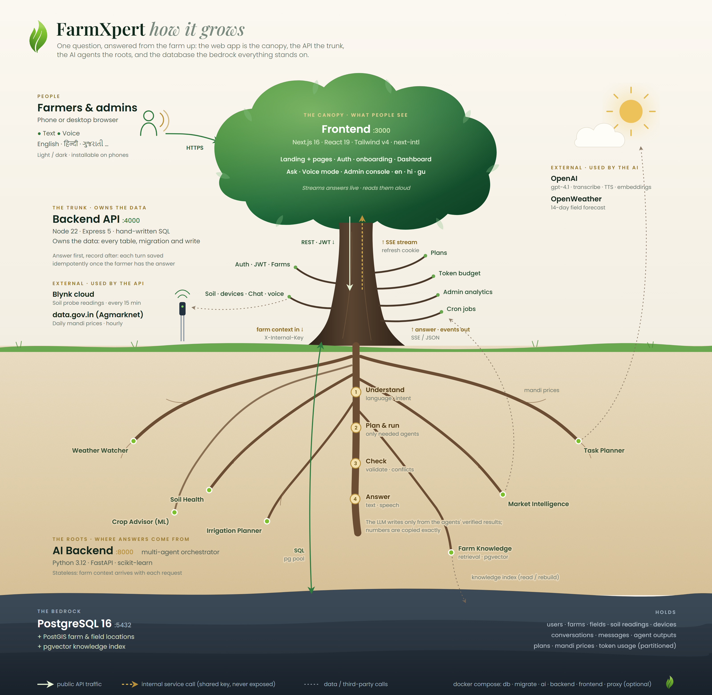

# FarmXpert

**An AI farm advisor for Indian farmers.** A farmer asks a question about their field,
typed or spoken, in their own language. FarmXpert runs the expert agents the question
needs (weather, soil, irrigation, crops, tasks, markets), checks their results against
each other and writes one clear answer. It uses that farm's own location, crop, soil
readings and history.

---

## What it does

| | |
|---|---|
| **Ask in any language** | Hindi, Gujarati, Marathi, Tamil, Telugu, Kannada, Bengali, Punjabi, English and more, in native script or in English letters |
| **Voice mode** | Hands-free, full-screen voice chat. The farmer speaks, and the answer is shown on screen and spoken back sentence by sentence |
| **Today's plan** | One tap turns the farm's soil, weather and crop stage into the day's plan, which is kept for the rest of the day |
| **Six expert agents + orchestrator** | Weather Watcher, Soil Health, Irrigation Planner, Crop Advisor, Task Planner, Market Intelligence, plus a farm-knowledge retriever |
| **Live soil probe** | Blynk sensor: air temperature and humidity, soil moisture and temperature, EC, pH and N-P-K, synced every 15 minutes (a mock mode works without hardware) |
| **Mandi prices** | Daily data.gov.in (Agmarknet) prices with the best nearby market and a sell-or-hold call |
| **Chat history** | Typed and voice conversations are saved and can be reopened from the sidebar |
| **Admin console** | Tokens and spend by purpose and model, engagement, latency (p50/p95), agent reliability, languages, and every account with its usage and devices |
| **Built for the field** | Light and dark themes, three UI languages (en/hi/gu), installable on phones, streamed answers for slow networks |

## Architecture



```
                  ┌──────────────────────────┐
  browser  ─────► │  Frontend  (Next.js)     │  :3000   landing, auth, dashboard, admin
                  └────────────┬─────────────┘
                               │  REST + server-sent events
                  ┌────────────▼─────────────┐
                  │  Backend  (Node/Express) │  :4000   auth, farms, sensors, chat, usage
                  └──────┬──────────────┬────┘
        farm context in, │              │  all reads and writes
            answer out   │              ▼
                  ┌──────▼──────────┐   ┌──────────────────────────────────┐
                  │ AI_Backend      │   │ PostgreSQL 16                    │
                  │ (FastAPI)  :8000│──►│ + PostGIS (locations)            │
                  └──────┬──────────┘   │ + pgvector (knowledge index)     │
                         │              └──────────────────────────────────┘
                         ▼
          OpenAI (LLM, speech) · OpenWeather · data.gov.in · Blynk
```

- **The Node backend owns the data.** It holds every table and migration, and all
  writes go through it: users, farms, fields, soil readings, conversations, agent
  outputs, plans, mandi prices and token usage.
- **The AI backend is stateless.** Node sends it everything a turn needs (location, the
  latest soil reading, crop, recent turns), and it never looks a farm up itself. Its
  only database use is the knowledge index.
- **Answer first, record after.** A chat turn is saved in one idempotent transaction
  after the farmer already has the answer. If the database fails, the turn's history is
  lost but the farmer still gets the answer.
- **Honest answers.** The language model writes only from the agents' validated results,
  and numbers are copied exactly. If data is missing, the answer says so.

## Project structure

```
FarmXpert/
├── Frontend/                 Next.js 16 · React 19 · Tailwind v4 · next-intl
│   ├── public/images/        botanical artwork
│   └── src/
│       ├── app/[locale]/     routes: landing + marketing pages, (app)/auth, onboarding, dashboard
│       ├── components/       landingpage/ marketing/ auth/ onboarding/ dashboard/ admin/ ui/
│       ├── context/          auth, farm and theme providers
│       ├── hooks/ lib/ services/
│       ├── i18n/  messages/  locales en · hi · gu
│       └── styles/           landing, auth and app stylesheets
│
├── Backend/                  Node 22 · Express 5 · pg (hand-written SQL) · Ajv · pino
│   ├── src/
│   │   ├── config/           all settings, validated at boot
│   │   ├── db/               pool, migration runner, migrations/, demo seed
│   │   ├── modules/          auth, farms, soil, chat, usage, admin, analytics, ...
│   │   ├── clients/          AI backend, data.gov.in, Blynk
│   │   ├── jobs/             cron: mandi prices, sensor sync, storage lifecycle
│   │   └── lib/              errors, validation, paging, logger
│   └── test/
│
├── AI_Backend/               Python 3.12 · FastAPI · scikit-learn
│   ├── agents/               the expert agents
│   ├── orchestration/        planner, scheduler, conflict checks, LLM, speech
│   ├── routers/              HTTP endpoints per agent + orchestrator
│   ├── core/  ml/  knowledge/
│   └── tests/
│
├── docker/                   postgres image (PostGIS + pgvector), nginx proxy config
├── docker-compose.yml
└── .env.example
```

## Quick start with Docker

Needs Docker with Compose v2.24 or later.

```bash
cp .env.example .env
```

```bash
cp Backend/.env.example Backend/.env
```

```bash
cp AI_Backend/.env.example AI_Backend/.env
```

Fill in these values before starting:

- **`.env`:** `POSTGRES_PASSWORD`.
- **`Backend/.env`:**
  - `INTERNAL_API_KEY` and `ADMIN_API_KEY`.
  - `JWT_SECRET` and `PASSWORD_PEPPER`, each 32+ characters (`openssl rand -base64 48`).
  - `SMTP_*` for the verification emails.
- **`AI_Backend/.env`:**
  - the **same** `INTERNAL_API_KEY` as in `Backend/.env`;
  - `LLM_API_KEY` and `SPEECH_API_KEY` (OpenAI);
  - optionally `OPENWEATHER_API_KEY`.

Start the stack:

```bash
docker compose up -d --build
```

The database starts first, then migrations run once, then the AI service, the API and
the web app. Open **http://localhost:3000**.

Optionally, create the demo farmer and an admin account:

```bash
docker compose exec backend npm run seed:demo
```

To serve everything from one origin on port 80 (`/api` goes to the API, everything
else to the app), set `PUBLIC_APP_URL` and `PUBLIC_API_URL` to that origin in `.env`,
then:

```bash
docker compose --profile proxy up -d --build
```

## Run locally without Docker

You need Node 22.9+, Python 3.11+, and PostgreSQL 14+ with the PostGIS and pgvector
extensions. Use one terminal per service.

**Backend**, from `Backend/`:

```bash
npm install
```

```bash
cp .env.example .env
```

```bash
npm run migrate
```

```bash
npm run dev
```

**AI backend**, from `AI_Backend/`:

```bash
pip install -r requirements.txt
```

```bash
cp .env.example .env
```

```bash
python -m uvicorn main:app --reload --port 8000
```

**Frontend**, from `Frontend/`:

```bash
npm install
```

```bash
cp .env.example .env.local
```

```bash
npm run dev
```

## Configuration

| File | What it holds |
|---|---|
| `.env` | Docker only: the database container, public URLs, published ports |
| `Backend/.env` | database, secrets, CORS, SMTP, mandi and Blynk settings, token limits and prices |
| `AI_Backend/.env` | LLM and speech models and keys, embeddings, weather key |
| `Frontend/.env.local` | `NEXT_PUBLIC_API_URL`: where the browser reaches the API |

These are the default models. OpenAI requires a verified organisation for the gpt-5
family, so the gpt-4.1 models are the defaults.

| Role | Model |
|---|---|
| Understanding a question | `gpt-4.1-nano` |
| Writing the answer | `gpt-4.1-mini`, with `gpt-4.1-nano` as the fallback |
| Speech to text | `gpt-4o-transcribe` |
| Text to speech | `gpt-4o-mini-tts` |
| Knowledge search | `text-embedding-3-small` |

Set `BLYNK_MOCK=true` in `Backend/.env` to use the static readings in
`Backend/src/data/sensor-mock.json` while the probe hardware is not connected.

## Tests

From `Backend/`:

```bash
npm test
```

From `AI_Backend/`, install the test tools once:

```bash
pip install -r requirements-dev.txt
```

Then, from the project root:

```bash
python -m pytest AI_Backend/tests -q
```

From `Frontend/`:

```bash
npm run lint
```

## More

- [Backend/README.md](Backend/README.md): the API routes and database design
- [Frontend/README.md](Frontend/README.md): the web app's structure, theming and translations
